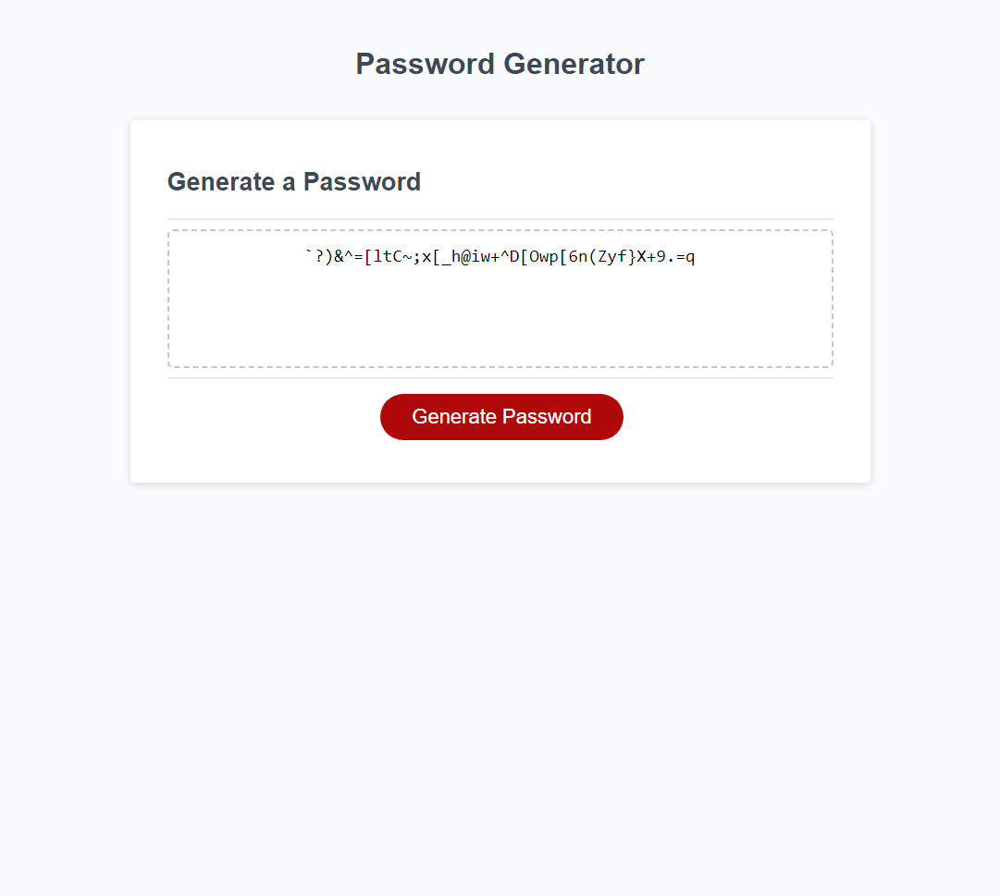

# Password-Generator

## Description
This repository allows users to create a randomly generated password based on specific criteria choosen by the user.

To view the Webpage click [here] (https://patrickodea.github.io/Password-Generator/).

## Usage
Users will click the generate password button, and enter the length of the password prompted.

The user will then confirm if they want numbers, special characters, uppercase letters, and lowercase letters.

After confirming the password characters the user will be able to see their randomly generated password.